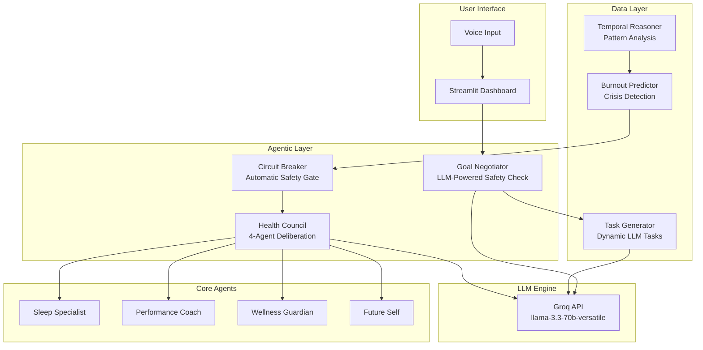
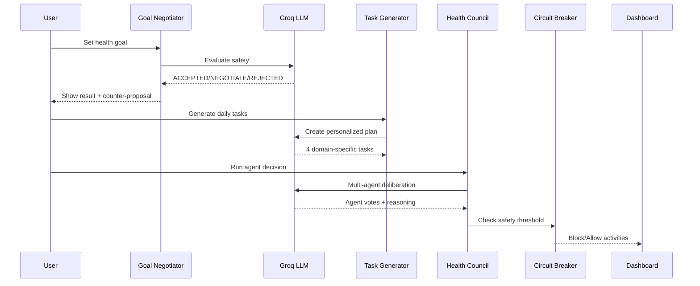

# Equilibra - AI Health Balance System

**Multi-Agent Agentic AI System for Burnout Prevention and Wellness Optimization**

🔗 **Live Demo:** [https://equilibra.streamlit.app/](https://equilibra.streamlit.app/)

---

## 👥 Team

| Name | Role |
|------|------|
| **Arnav Ranjan** | Team Lead |
| **Om Raj** | Developer |
| **Kushal Raj** | Developer |

**College:** Manipal Institute of Technology, Manipal

---

## 🌟 Overview

Equilibra is an advanced **agentic AI system** that prevents burnout through multi-agent collaboration, LLM-powered reasoning, and temporal analysis. Unlike traditional health trackers that simply log data, Equilibra actively deliberates, predicts crises, and intervenes before problems occur.

### Key Features

| Feature | Description |
|---------|-------------|
| 🤖 **Multi-Agent Health Council** | 4 specialized AI agents collaborate via LLM to make decisions |
| 🛡️ **Circuit Breaker** | Automatically blocks high-intensity activities when safety thresholds are exceeded |
| 📋 **Dynamic Task Generation** | LLM generates personalized daily tasks based on your goal |
| 🎯 **Goal Negotiator** | AI evaluates goal safety and suggests modifications |
| 🔮 **Temporal Reasoning** | Analyzes past patterns, present context, and future trajectories |
| ⚠️ **Crisis Prediction** | Forecasts burnout 3-7 days in advance |
| 🎙️ **Voice Interaction** | Speak to the AI using Groq Whisper transcription |
| 🎮 **Gamification** | Daily streaks and achievement system |

### 🎨 UI Updates (v2.0)

The latest version features a completely redesigned landing page and onboarding experience:

| Update | Description |
|--------|-------------|
| 🎨 **Modern Landing Page** | Sleek design with gradient effects and animations |
| 💎 **Brand Logo** | Diamond logo integrated across navigation, footer, and onboarding |
| 🌈 **Gradient Effects** | Purple/blue/orange background glows for visual depth |
| ✨ **Curved Underline** | Decorative U-shaped underline beneath "Health Balance" |
| 🎭 **Pure Black Theme** | Enhanced contrast with true black background |
| 📱 **Responsive Design** | Optimized for all screen sizes |
| 🎬 **Framer Motion** | Smooth entrance animations and transitions |

**Tech Stack:**
- React + TypeScript
- Framer Motion for animations
- Tailwind CSS for styling
- Lucide React icons

---

## 🏗️ System Architecture



### Agent Workflow



---

## 🔧 Installation & Setup

### Prerequisites

Before you begin, ensure you have the following installed:

| Requirement | Version | Download |
|-------------|---------|----------|
| Python | 3.10 or higher | [python.org](https://www.python.org/downloads/) |
| Node.js | 18.x or higher | [nodejs.org](https://nodejs.org/) |
| npm | Latest | Comes with Node.js |
| Git | Any | [git-scm.com](https://git-scm.com/downloads) |
| Groq API Key | Free tier | [console.groq.com](https://console.groq.com) |

### Step 1: Clone the Repository

```bash
git clone https://github.com/ranjan-arnav/equilibria.git
cd equilibria
```

### Step 2: Install Backend Dependencies

```bash
pip install -r requirements.txt
```

This installs:
- `fastapi` - Modern web framework
- `uvicorn` - ASGI server
- `groq` - LLM API client
- `python-dotenv` - Environment variable management
- `pydantic` - Data validation

### Step 3: Install Frontend Dependencies

```bash
cd frontend
npm install
cd ..
```

This installs:
- `react` - UI framework
- `vite` - Build tool
- `framer-motion` - Animation library
- `lucide-react` - Icon library
- `tailwindcss` - CSS framework

### Step 4: Get Groq API Key

1. Visit [console.groq.com](https://console.groq.com)
2. Sign up for a free account
3. Navigate to **API Keys** section
4. Click **Create API Key**
5. Copy the generated key

### Step 5: Configure Environment Variables

Create a `.env` file in the project root:

```bash
# Windows (PowerShell)
New-Item -Path ".env" -ItemType File

# macOS/Linux
touch .env
```

Add your API key to the `.env` file:

```env
GROQ_API_KEY=gsk_your_api_key_here
GROQ_MODEL=llama-3.3-70b-versatile
```

### Step 6: Run the Application

**Single Command (Recommended):**

```bash
python start_app.py
```

This will automatically start:
- Backend (FastAPI) on `http://localhost:8000`
- Frontend (React/Vite) on `http://localhost:5173`

**Manual Start (Alternative):**

Terminal 1 - Backend:
```bash
python -m uvicorn backend.main:app --reload --port 8000
```

Terminal 2 - Frontend:
```bash
cd frontend
npm run dev
```

### Step 7: Access the Application

Open your browser and navigate to:
```
http://localhost:5173
```

The application will display the landing page. Click **"View Live Demo"** to start onboarding.

### Step 8: First Time Setup

1. Complete the onboarding flow:
   - Enter your name and age
   - Set current health state (sleep, energy, stress)
   - Define your health goal
   - Review AI-generated daily tasks

2. Explore the dashboard:
   - **Home**: Daily metrics and burnout risk monitor
   - **Council**: Multi-agent deliberation view
   - **Make Decision**: Run the AI decision engine
   - **Chat**: Conversational AI interface

---

## 💡 Example Usage & Interaction Flows

### Flow 1: Goal Setting with AI Safety Check

```
User: "I want to lose 10kg in 2 weeks"
                    ↓
        Goal Negotiator (LLM)
                    ↓
Status: NEGOTIATE
Counter-proposal: "Lose 10kg over 10 weeks (1kg/week)"
Reasoning: "Rapid weight loss exceeds safe threshold of 1.2kg/week"
Safety Score: 0.3
```

### Flow 2: Dynamic Task Generation

```
User Goal: "Train for a marathon"
                    ↓
        Task Generator (LLM)
                    ↓
Generated Tasks:
1. 🏋️ Long Distance Run (60min) - Fitness
2. 🥗 Carbohydrate Loading (30min) - Nutrition  
3. 😴 Active Recovery Stretching (20min) - Recovery
4. 🧘 Mental Visualization (15min) - Mindfulness
```

### Flow 3: Circuit Breaker Activation

```
Current State:
- Sleep: 4 hours ❌
- Energy: 2/10 ❌
- Stress: High ❌
                    ↓
        Health Council Deliberates
                    ↓
Sleep Specialist: SKIP (0.95 confidence)
"Critical sleep debt. High-intensity exercise increases cortisol."
                    ↓
        Circuit Breaker ENGAGED
                    ↓
Result: Fitness task BLOCKED 🚫
Recommendation: "Rest, light activity, or recovery today"
```

### Flow 4: Multi-Agent Consensus

```
Planned Activity: HIIT Workout
User State: Moderate sleep, Low energy, High stress
                    ↓
        4 Agents Vote:
        
🛏️ Sleep Specialist: MODIFY (0.75)
   "Suboptimal sleep. Lower intensity recommended."
   
📈 Performance Coach: PROCEED (0.6)
   "Moderate energy. Maintain activities."
   
🧘 Wellness Guardian: SKIP (0.85)
   "High stress. Additional load risks burnout."
   
🔮 Future Self: PROCEED (0.8)
   "Good consistency. Your future self thanks you."
                    ↓
        Consensus: MODIFY (58%)
        
Final Decision: Reduce workout intensity
```

---

## ⚙️ System Assumptions

### User Model
- User provides honest self-reported data (sleep, energy, stress)
- User has a primary health/fitness goal
- User is not seeking medical diagnosis

### Safety Thresholds

| Metric | Safe | Caution | Critical |
|--------|------|---------|----------|
| Sleep | ≥7h | 6-7h | <6h |
| Energy | ≥6/10 | 4-5/10 | <4/10 |
| Stress | Low | Moderate | High |

### LLM Behavior
- **Model:** `llama-3.3-70b-versatile` via Groq
- **Response format:** JSON for structured outputs
- **Fallback:** Heuristic rules if LLM fails

---

## 🚧 Limitations

### Technical Limitations

| Limitation | Impact | Mitigation |
|------------|--------|------------|
| Synthetic wearable data | No real biometrics | Simulated data for demo |
| Groq free tier limits | Rate limiting possible | Graceful fallbacks implemented |
| English only | Limited accessibility | UI in English |
| No persistent storage | Data lost on restart | Session-based storage |

### Scope Limitations

- **Not medical advice**: System provides wellness suggestions, not diagnoses
- **Self-reported bias**: Relies on user honesty for input data
- **Single user**: Designed for individual use

---

## 📁 Project Structure

```
equilibria/
├── src/
│   ├── agents/
│   │   ├── health_council.py      # LLM-powered 4-agent deliberation
│   │   ├── goal_negotiator.py     # LLM goal safety evaluation
│   │   ├── chat_agent.py          # Conversational AI
│   │   ├── burnout_predictor.py   # Crisis forecasting
│   │   └── temporal_reasoner.py   # Pattern analysis
│   ├── core/
│   │   └── config.py              # Configuration
│   ├── models/
│   │   └── decision.py            # Data models
│   └── main.py                    # Task generator + Orchestrator
├── ui/
│   └── streamlit_app.py           # Main dashboard
├── .env                           # API keys (create this)
├── requirements.txt               # Dependencies
└── README.md                      # This file
```

---

## 🏆 Hackathon Alignment

| Criteria | Weight | Implementation |
|----------|--------|----------------|
| **Novelty & Creativity** | 30% | Multi-agent LLM collaboration, Circuit Breaker, Temporal reasoning |
| **Agentic System Design** | 25% | 4 autonomous agents, goal-oriented behavior, proactive intervention |
| **Implementation Quality** | 20% | Clean architecture, error handling, LLM fallbacks |
| **Scope & Usefulness** | 15% | Real burnout prevention, practical constraints |
| **Documentation** | 10% | Comprehensive README, architecture diagrams |

---

## 📜 License

MIT License - See LICENSE file for details

---

## 🙏 Acknowledgments

- **Groq** - Fast LLM inference
- **Streamlit** - UI framework
- **LangChain** - Agent orchestration patterns
